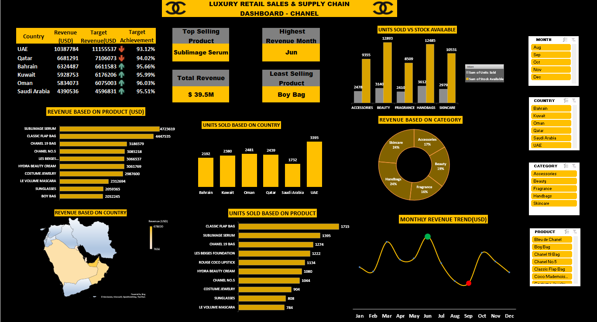

# 📊 Luxury Retail Sales & Supply chain Dashboard - Chanel 

## 📌 Project Overview

Developed interactive dashboard to analyze sales and supply chain performance using a Chanel (Brand) -inspired dataset. 
This project focuses on understanding retail performance across countries, product categories & time trends.

## 🔍 Key Insights
• UAE has the highest revenue, while Saudi Arabia has the lowest, showing room for improvement.
• Overall revenue is slightly below target, so performance can be improved.
• “Sublimage Serum” is the top-selling product, while “Boy Bag” has the lowest sales.
• Revenue is highest in June, showing a strong monthly peak.

 ## 🛠  Tools & Skills Used:
• Advanced Excel Formulas(Pivot Tables, XLOOKUP, AGGREGATE)
• Data Cleaning & Transformation
• Dashboard Design & Data Visualization (Pivot tables & Charts)

This project helped me strengthen my data analysis and reporting skills while working with real-world business scenarios.

## 📷 Dashboard Preview

